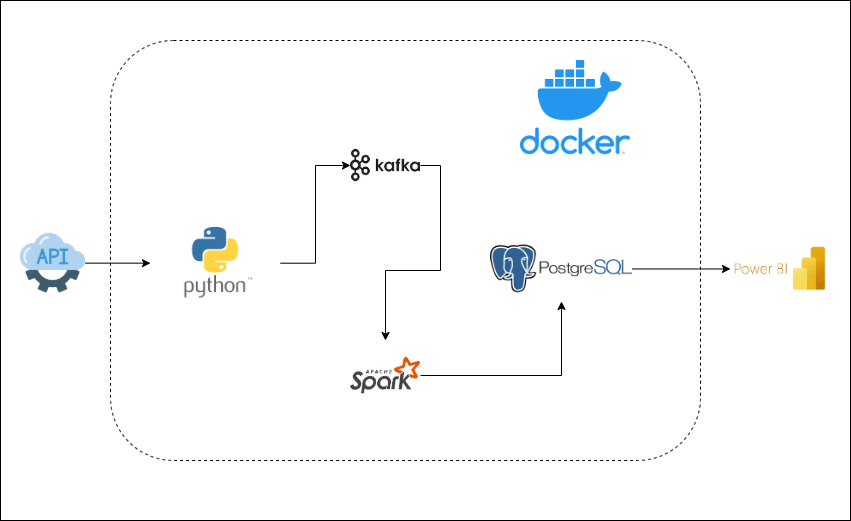

# Real Time Stock Market Analysis

Project Objectives

This project aims to implement a reliable and scalable ETL data pipeleine for processing and streaming stock market data with low latency.

Real-Time insights visualization on stock treands, trading volumes and other financial metrics.

The implementation of this project is a Python-based ETL pipeline that extracts stock market data in JSON format from the Alpha Vantage API. Python is used mainly to filter the extracted data and selext the required fields before publishing the recoreds to Apache Kafka. 

### Project DataPipeline Architecutre.

The project components are containerized and managed using Docker compose, allowing Kafka, Spark, PostgresSQL and pgAdmin to run together with the same developement environement

Project Tech Stack and Flow
    - 'Python -> For data integration, processing and API interaction.'
    - 'Apache Kafka -> To inspect and stream real-time data from multiple sources.'
    - 'API -> producses JSON events into Kafka.'
    - 'Apache Spark -> consumes large scale data from Kafka and processes into Postgres.'
    - 'Postgres -> stores results for analytics and reports'
    - 'pgAdmin -> manage Postgres visually.'
    - 'Power BI -> external (connects to Postgres database).'